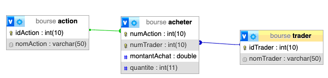

# TD 1 - Base de données Bourse 

## Objectif
Créer et tester la base de données définit par le schema suivant

## Créer la base de données bourse et 2 utilisateurs dédiés à cette base de données

- Ecrire une requête permettant de créer la base de données
- Ecrire une requête permettant de créer un utilisateur 'bourse_adm' et lui assigner seulement les privilèges de structure
- Ecrire une requête permettant de créer un utilisateur 'bourse_usr' et lui assigner seulement les privilèges d'utilisation

> Info
> Les requêtes devront être passées avec l'utilisateur adéquate de la base de données bourse

## Créer les tables

Ecrire une requête afin de créer les tables suivantes

> **Table Trader**
> - idTrader : entier de taille 10 maximum
> - nomTrader : chaîne de caractères de taille 50 maximum

> **Table Action**
> - idAction : entier de taille 10 maximum
> - nomAction : chaîne de caractères de taille 50 maximum

> **Table Acheter**
> - numAction : entier de taille 10 maximum (clé étrangère référençant idAction)
> - numTrader : entier de taille 10 maximum (clé étrangère référençant idTrader)
> - montantAchat : double
> - quantite : entier de taille 11 maximum
> 
> **Attention** : La clé primaire est composée des attributs « numAction » et « numTrader »

## Insertion de données

- Insérer 2 traders
- Insérer 3 actions
- Insérer des données dans la table 'acheter'

## Mise à jour corrective des tables et du contenu

- L’attribut « nomTrader » de la table « Trader » est une chaîne de taille 30 au maximum 
- On souhaite ajouter le numéro de téléphone du trader qui est une chaîne de taille 10 au maximum
- On souhaite renommer l’attribut « montantAchat » de la table « Acheter » en « prixAction »
- Modifier pour chaque trader, les téléphones suivants :
  - Trader n°1 -> 0102030405
  - Trader n°2 -> 0123456789

## Requêtes à effectuer

- Afficher le total du portefeuille de chaque trader (nom + montant)
- Afficher le nom des actions que le trader « Enzo » ne possède pas
